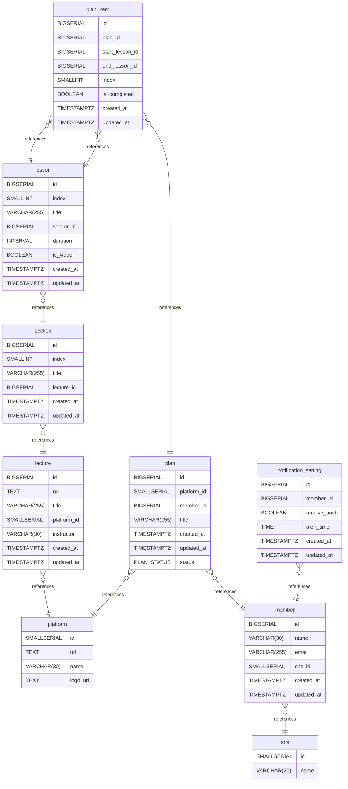

# Backend 설명서

## How to Run a Local Database

```zsh
docker run --name maegang-db -p 5432:5432 -d \
-e POSTGRES_USER=postgres \
-e POSTGRES=postgres \
-e POSTGRES_DB=maegang \
postgres
```

## Database Design Document

### Database Schema

> View from a [file](maegang/src/main/resources/schema.sql)

### Entity Relationship Diagram

> View as an [image](docs/erd.png)



---

### Table structure

#### member

사용자

| Name           | Type         | Settings                              | References       | Note |
|----------------|--------------|---------------------------------------|------------------|------|
| **id**         | BIGSERIAL    | 🔑 PK, not null                       |                  |      |
| **name**       | VARCHAR(30)  | not null                              |                  |      |
| **email**      | VARCHAR(255) | not null , unique                     |                  |      |
| **sns_id**     | SMALLSERIAL  | not null                              | member_sns_id_fk |      |
| **created_at** | TIMESTAMPTZ  | not null , default: CURRENT_TIMESTAMP |                  |      |
| **updated_at** | TIMESTAMPTZ  | not null , default: CURRENT_TIMESTAMP |                  |      |

##### Indexes

| Name                      | Unique | Fields |
|---------------------------|--------|--------|
| member_email_unique_index | ✅      | email  |
| member_sns_id_index       |        | sns_id |

#### lecture

강의

| Name            | Type         | Settings                              | References     | Note |
|-----------------|--------------|---------------------------------------|----------------|------|
| **id**          | BIGSERIAL    | 🔑 PK, not null                       |                |      |
| **url**         | TEXT         | not null , unique                     |                |      |
| **title**       | VARCHAR(255) | not null                              |                |      |
| **platform_id** | SMALLSERIAL  | not null                              | platform_id_fk |      |
| **instructor**  | VARCHAR(30)  | not null                              |                |      |
| **created_at**  | TIMESTAMPTZ  | not null , default: CURRENT_TIMESTAMP |                |      |
| **updated_at**  | TIMESTAMPTZ  | not null , default: CURRENT_TIMESTAMP |                |      |

##### Indexes

| Name                      | Unique | Fields      |
|---------------------------|--------|-------------|
| lecture_url_unique_index  | ✅      | url         |
| lecture_platform_id_index |        | platform_id |

#### lesson

수업

| Name           | Type         | Settings                              | References    | Note         |
|----------------|--------------|---------------------------------------|---------------|--------------|
| **id**         | BIGSERIAL    | 🔑 PK, not null                       |               |              |
| **index**      | SMALLINT     | not null                              |               | 섹션 내 수업의 인덱스 |
| **title**      | VARCHAR(255) | not null                              |               |              |
| **section_id** | BIGSERIAL    | not null                              | section_id_fk |              |
| **duration**   | INTERVAL     | not null , default: 0                 |               |              |
| **is_video**   | BOOLEAN      | not null , default: false             |               |              |
| **created_at** | TIMESTAMPTZ  | not null , default: CURRENT_TIMESTAMP |               |              |
| **updated_at** | TIMESTAMPTZ  | not null , default: CURRENT_TIMESTAMP |               |              |

##### Indexes

| Name                                 | Unique | Fields            |
|--------------------------------------|--------|-------------------|
| lesson_section_id_index_unique_index | ✅      | section_id, index |
| lesson_section_id_index              |        | section_id        |

#### section

단원

| Name           | Type         | Settings                              | References    | Note        |
|----------------|--------------|---------------------------------------|---------------|-------------|
| **id**         | BIGSERIAL    | 🔑 PK, not null                       |               |             |
| **index**      | SMALLINT     | not null                              |               | 단원(섹션)의 인덱스 |
| **title**      | VARCHAR(255) | not null                              |               |             |
| **lecture_id** | BIGSERIAL    | not null                              | lecture_id_fk |             |
| **created_at** | TIMESTAMPTZ  | not null , default: CURRENT_TIMESTAMP |               |             |
| **updated_at** | TIMESTAMPTZ  | not null , default: CURRENT_TIMESTAMP |               |             |

##### Indexes

| Name                                  | Unique | Fields            |
|---------------------------------------|--------|-------------------|
| section_lecture_id_index_unique_index | ✅      | lecture_id, index |
| section_lecture_id_index              |        | lecture_id        |

#### platform

강의 플랫폼

| Name         | Type        | Settings        | References | Note |
|--------------|-------------|-----------------|------------|------|
| **id**       | SMALLSERIAL | 🔑 PK, not null |            |      |
| **url**      | TEXT        | not null        |            |      |
| **name**     | VARCHAR(30) | not null        |            |      |
| **logo_url** | TEXT        | not null        |            |      |

#### plan

학습 계획

| Name            | Type         | Settings                              | References          | Note |
|-----------------|--------------|---------------------------------------|---------------------|------|
| **id**          | BIGSERIAL    | 🔑 PK, not null                       |                     |      |
| **platform_id** | SMALLSERIAL  | not null                              | plan_platform_id_fk |      |
| **member_id**   | BIGSERIAL    | not null                              | plan_member_id_fk   |      |
| **title**       | VARCHAR(255) | not null                              |                     |      |
| **created_at**  | TIMESTAMPTZ  | not null , default: CURRENT_TIMESTAMP |                     |      |
| **updated_at**  | TIMESTAMPTZ  | not null , default: CURRENT_TIMESTAMP |                     |      |
| **status**      | PLAN_STATUS  | not null , default: 'PENDING'         |                     |      | 

##### Indexes

| Name                   | Unique | Fields      |
|------------------------|--------|-------------|
| plan_member_id_index   |        | member_id   |
| plan_platform_id_index |        | platform_id |

#### plan_item

학습 범위 (액션 아이템)

| Name                | Type        | Settings                              | References                    | Note                  |
|---------------------|-------------|---------------------------------------|-------------------------------|-----------------------|
| **id**              | BIGSERIAL   | 🔑 PK, not null                       |                               |                       |
| **plan_id**         | BIGSERIAL   | not null                              | plan_item_plan_id_fk          |                       |
| **start_lesson_id** | BIGSERIAL   | not null                              | plan_item_start_lecture_id_fk |                       |
| **end_lesson_id**   | BIGSERIAL   | not null                              | plan_item_end_lecture_id_fk   |                       |
| **index**           | SMALLINT    | not null                              |                               | N일차, W주차 등 표시를 위한 인덱스 |
| **is_completed**    | BOOLEAN     | not null , default: false             |                               |                       |
| **created_at**      | TIMESTAMPTZ | not null , default: CURRENT_TIMESTAMP |                               |                       |
| **updated_at**      | TIMESTAMPTZ | not null , default: CURRENT_TIMESTAMP |                               |                       | 

##### Indexes

| Name                                 | Unique | Fields          |
|--------------------------------------|--------|-----------------|
| plan_item_plan_index                 |        | plan_id         |
| plan_item_start_lesson_id_index      |        | start_lesson_id |
| plan_item_end_lesson_id_index        |        | end_lesson_id   |
| plan_item_plan_id_index_unique_index | ✅      | plan_id, index  |

#### sns

| Name     | Type        | Settings          | References | Note |
|----------|-------------|-------------------|------------|------|
| **id**   | SMALLSERIAL | 🔑 PK, not null   |            |      |
| **name** | VARCHAR(20) | not null , unique |            |      | 

#### notification_setting

알림 설정

| Name             | Type        | Settings                              | References                         | Note |
|------------------|-------------|---------------------------------------|------------------------------------|------|
| **id**           | BIGSERIAL   | 🔑 PK, not null                       |                                    |      |
| **member_id**    | BIGSERIAL   | not null , unique                     | notification_settings_member_id_fk |      |
| **receive_push** | BOOLEAN     | not null , default: true              |                                    |      |
| **alert_time**   | TIME        | not null                              |                                    |      |
| **created_at**   | TIMESTAMPTZ | not null , default: CURRENT_TIMESTAMP |                                    |      |
| **updated_at**   | TIMESTAMPTZ | not null , default: CURRENT_TIMESTAMP |                                    |      |

#### Relationships

- **lecture -> platform**: one_to_many
- **section -> lecture**: one_to_many
- **lesson -> section**: one_to_many
- **plan -> member**: one_to_many
- **plan -> platform**: one_to_many
- **plan_item -> plan**: one_to_many
- **plan_item -> lesson**: one_to_many
- **member -> sns**: one_to_many
- **notification_setting -> member**: one_to_many
