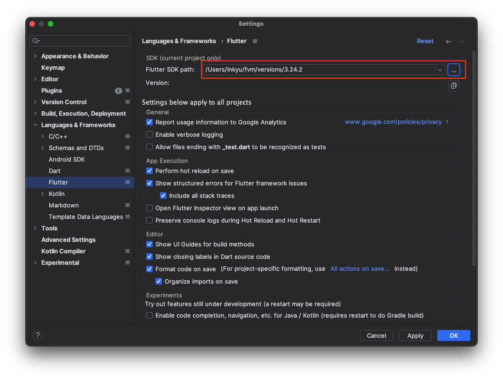

# 매일강도 Frontend

## 프로젝트 세팅

### ⚠️ 지금 당장은 2 ~ 4번 과정을 수행할 필요가 없습니다. 추후 직접 앱을 빌드해야하는 경우, 추가적인 설명을 드리겠습니다. 

### 1. 플러터 프로젝트 웹에서 실행하기
웹 서버를 통해 플러터 프로젝트를 실행하실 수 있습니다. (별도의 설치가 필요하지 않아 python을 이용하였습니다.)

```bash
cd web
python3 -m http.server {PORT_NUM} # 원하는 포트넘버를 입력해주세요.
```
이후 브라우저에서 `localhost:{PORT_NUM}`으로 접속하면 앱을 확인할 수 있습니다.


### 2. fvm (flutter version manager) 설치

다음 명령어를 통해 fvm을 설치합니다.

```bash
brew tap leoafarias/fvm
brew install fvm
```
두 번째 명령어를 입력할때, 경우에 따라 다음과 같은 메시지를 받을 수 있습니다.

```text
Error: Your Command Line Tools are too outdated.
Update them from Software Update in System Settings.

If that doesn't show you any updates, run:
  sudo rm -rf /Library/Developer/CommandLineTools
  sudo xcode-select --install

Alternatively, manually download them from:
  https://developer.apple.com/download/all/.
You should download the Command Line Tools for Xcode 15.4.
```
해당 메시지가 나오면, 안내된 내용 그대로 실행하시면 됩니다.
```bash
sudo rm -rf /Library/Developer/CommandLineTools
sudo xcode-select --install

brew install fvm # 다시 입력
```

설치 여부는 다음 명령어로 확인하실 수 있습니다.
```bash
fvm -v # 3.2.1
```

### 3. Flutter 버전 고정
다음은 2024.09.05 기준으로 mac 환경에서 `dart`와 `flutter`의 stable한 버전입니다. 

|  name   |  ver   |
|:-------:|:------:|
|  Dart   | 3.5.2  |
| Flutter | 3.24.2 |

다음 명령어를 통해 flutter 3.24.2 버전을 설치하고, 해당 버전을 사용합니다.
```bash
fvm install 3.24.2
fvm use # 명령어를 입력하고, 설치한 버전을 선택하면 필요한 패키지들을 자동으로 다운로드합니다.
```


### 4. Android 설정
- `command` + `,` 을 눌러 `Languages & Frameworks > Flutter` 탭으로 이동합니다.
- 그 이후 Flutter SDK path를 설정하신 후 `OK`를 눌러주세요. (종종 Apply를 누르면 안되는 경우가 발생합니다.)
